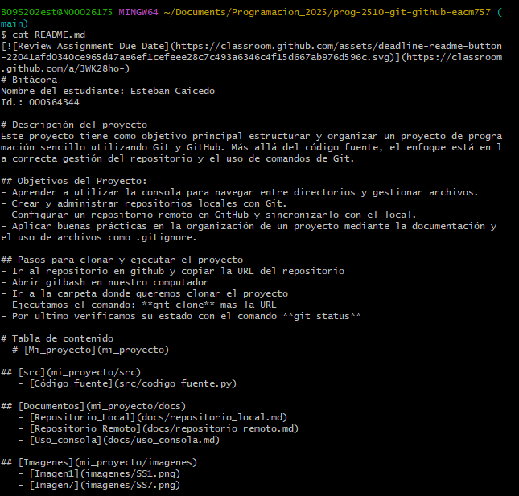

# Uso de la Consola para Navegación y Manejo de Archivos

## Navegación en la Consola
La consola o terminal permite interactuar con el sistema operativo mediante comandos. Para moverse entre directorios, se utilizan los siguientes comandos:

- **`pwd`** → Muestra la ruta del directorio actual.

- **`ls`** → Lista los archivos y carpetas en el directorio actual.

  - `ls -l` → Muestra detalles adicionales de los archivos.
  - `ls -a` → Muestra archivos ocultos.
  
- **`cd [directorio]`** → Cambia al directorio especificado.
  - `cd ..` → Retrocede un nivel en la jerarquía de directorios.
  - `cd /` → Va a la raíz del sistema.
  - `cd ~` → Va al directorio de inicio del usuario.

## Creación y Manejo de Directorios
Para gestionar directorios, los comandos principales son:

- **`mkdir [nombre_directorio]`** → Crea un nuevo directorio.
- **`rmdir [nombre_directorio]`** → Elimina un directorio vacío.
- **`rm -r [nombre_directorio]`** → Elimina un directorio y su contenido.

## Creación y Manejo de Archivos
Los comandos más utilizados para trabajar con archivos incluyen:

- **`touch [nombre_archivo]`** → Crea un archivo vacío.
- **`echo "contenido" > archivo.txt`** → Crea un archivo con contenido.
- **`cat [nombre_archivo]`** → Muestra el contenido de un archivo.

- **`nano [nombre_archivo]`** → Abre un archivo en el editor de texto Nano.
- **`mv [archivo_origen] [archivo_destino]`** → Mueve o renombra un archivo.
- **`cp [archivo_origen] [archivo_destino]`** → Copia un archivo.
- **`rm [nombre_archivo]`** → Elimina un archivo.

